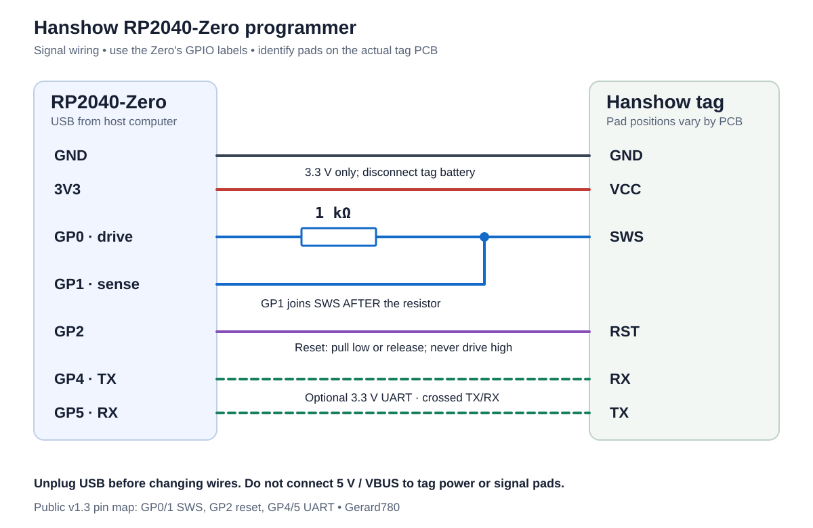

# Hanshow RP2040-Zero programmer

Source, wiring and **public v1.5 programmer firmware (experimental)** for our RP2040-Zero
Telink SWS bridge. It exposes a USB SWS programmer and a separate USB tag UART,
with native PIO reply capture and up to 4 KiB per block-read request.

Use it to capture factory firmware **before changing a tag**, preserve a
recovery backup, and provide evidence for additional Hanshow display support.
The new reader attempts legacy **825x-style and 826x-style SWS/SPI** backends,
checks repeated chip/JEDEC responses, detects flash capacity and requires
matching sample reads before two full captures. It has no exact chip-ID or
flash-manufacturer allowlist. The legacy register/SPI protocol and 24-bit flash
addressing still limit compatibility; modern Telink families need their own
backend. The known Nebular chip/flash path has bench evidence. Other chips and
the 826x framing path remain experimental until tested on physical hardware.

The v1.5 source and UF2 combine the faster PIO transport, the browser USB
interface and the public two-/three-byte SWS addressing. Python reads default
to **2 Mbaud** on v1.4/v1.5; use `--baud 1500000` for the explicit fallback.
Older bridges keep the 921600 default. Matching independent captures are
required: the earlier 2.5/3 Mbaud experiments produced intermittent errors.
The measured 30-second reads belong to the bench v1.4 build on one specimen;
the combined public v1.5 UF2 still needs physical validation.

[Download the experimental v1.5 release](https://github.com/gerard780/hanshow-rp2040-programmer/releases/tag/v1.5) ·
[Browser dumper](firmware-dumper/README.md) ·
[Guarded write tools](tools/speed/README.md) ·
[Development results](docs/DEVELOPMENT-STATUS.md)

## Build the programmer

You need a **Waveshare RP2040-Zero**, USB data cable, a **1 kΩ resistor** and
short wires to identified tag pads. Use the Zero's printed **GPIO numbers**,
not Raspberry Pi Pico header pin numbers. Locate GND, VCC, SWS and RST on the
actual tag PCB; their physical positions vary by model and revision.



| RP2040-Zero connection | Tag connection |
| --- | --- |
| GND | GND |
| 3V3 | VCC, with tag batteries disconnected |
| GP0 | **Through 1 kΩ** to SWS |
| GP1 | **Directly to SWS**, on the tag side of the resistor |
| GP2 | RST |
| GP4 (UART TX), optional | Tag RX |
| GP5 (UART RX), optional | Tag TX |

GP0 drives commands through the resistor; GP1 senses the tag reply directly.
Both wires meet at the same SWS pad. Disconnect USB while changing wiring.
Use **3.3 V**, common ground and short SWS leads. **Do not connect USB 5 V/VBUS
to tag VCC or use 5 V logic.** Remove/disconnect the tag battery when powering
it from the Zero's 3V3 output. This diagram is a signal map, not a tag pad map.

See [Waveshare's board documentation](https://www.waveshare.com/wiki/RP2040-Zero)
for the Zero layout.

## Completed adapter, schematic and photos

The [hardware package](hardware/as-built/README.md) documents Gerard780's
completed hand-wired programmer with both original photos, an editable
KiCad 7+ project, project-local symbols/footprints and an illustrative 3D
assembly. The schematic matches the GPIO wiring above.


[Printable schematic PDF](hardware/as-built/exports/schematic.pdf) ·
[Editable schematic](hardware/as-built/RP2040_Tag_Adapter.kicad_sch) ·
[Tag connector photo](hardware/as-built/reference/tag-connector-photo.jpg) ·
[3D render](hardware/as-built/exports/adapter-render.png)

The PCB file records the existing assembly. Its dimensions and wire shapes
are approximate; it is not a routed board for fabrication. Instructions for
opening the CAD project and local interactive 3D viewer are in the hardware
package.

## Install the programmer UF2

Hold the Zero's BOOT button while connecting USB to enter BOOTSEL. Copy
[dist/hanshow_pio_bridge.uf2](dist/hanshow_pio_bridge.uf2) to the `RPI-RP2`
drive. The board restarts with two USB serial interfaces. This installs
firmware on the **programmer**, not on the tag.

UF2 SHA-256:

```text
845d574f41a5349530d8ac33096515368c4d0390398182d6dc620bf06fdc0e7d
```

The supplied UF2 has tag reset enabled. On the SWS port, GP2 pulls reset low
only while **both DTR and RTS are asserted**; otherwise it releases the pin
as an input. It never drives RST high. The second port's modem controls do
not reset the tag. Interface `if00` is SWS; `if02` is the tag UART. Serial
device numbers can change. Each Zero derives its USB serial from its own ID.

## Take a verified factory readback

The [readback guide](docs/READBACK.md) covers setup, identifying the correct
port/board, two full reads, hash verification, and what to send for a support
request. The command below uses the supplied pinned reader dependency:

```sh
python3 -m venv .venv
.venv/bin/python -m pip install -r requirements.txt
.venv/bin/python -m serial.tools.list_ports -v

# Replace both placeholders with the SWS interface and your Zero's serial ID.
# USB and serial permissions are required; Linux may require sudo for PyUSB.
sudo .venv/bin/python readback.py \
  --port /dev/serial/by-id/YOUR_ZERO_SWS_INTERFACE_if00 \
  --bridge-serial YOUR_ZERO_SERIAL --family auto --mode block \
  --runs 2 --output factory-backup
```

Choose a new output directory each time. Successful output contains two matching files and `readback.json` with
`verified: true`. A factory dump should also report `complete_flash: true`;
explicit smaller reads are labeled partial. Auto-size supports conventional
JEDEC capacities up to 16 MiB; nonstandard capacity encodings need `--size`.
The helper uses temporary debug/SPI register operations and attempts CPU reset
after reading; it does not call tag flash erase, programming or unlock routines.
The vendored upstream flasher also contains write commands; follow the
readback helper workflow when collecting factory evidence.

## Build from source

Requires CMake, Arm bare-metal GCC with newlib, and Pico SDK **2.2.0** with its
TinyUSB submodule. The shipped build uses SDK commit
`a1438dff1d38bd9c65dbd693f0e5db4b9ae91779`, TinyUSB commit
`86ad6e56c1700e85f1c5678607a762cfe3aa2f47` and GCC **13.2.1**.

```sh
cmake -S . -B build \
  -DPICO_SDK_PATH=/path/to/pico-sdk \
  -DPICO_TOOLCHAIN_PATH=/path/to/arm-toolchain \
  -DPICO_NO_PICOTOOL=1 -DCMAKE_BUILD_TYPE=Release \
  -DENABLE_TAG_RESET=ON
SOURCE_DATE_EPOCH=1791158400 cmake --build build -j6
python3 make_uf2.py build/hanshow_pio_bridge.bin build/hanshow_pio_bridge.uf2
```

The build date is fixed above for reproducible UF2 output. Source builds default
to reset OFF; use `-DENABLE_TAG_RESET=ON` to match the
supplied firmware. See [build provenance](docs/BUILD-PROVENANCE.json),
[validation](docs/VALIDATION.md) and [USB protocol](docs/PROTOCOL.md).

## Credits and related firmware

Programmer implementation and bench testing: **Gerard780**, with AI-assisted
implementation and analysis. PIO adaptations credit Raspberry Pi's
`pico-examples` and David Given's `telinkdebugger`; the two host backends are pvvx's
`TLSR825xComFlasher.py` and `TLSR826xComFlasher.py` with upstream contributors. See
[third-party notices](THIRD-PARTY-NOTICES.md) and [licenses](licenses/).

Original project code is MIT licensed; third-party portions keep their own
licenses. This repository contains no tag firmware dumps or per-tag backups.
The [unified Nebular firmware project](https://github.com/gerard780/nebular-pro-qn-atc-oepl)
contains the supported display application and AP profiles.
